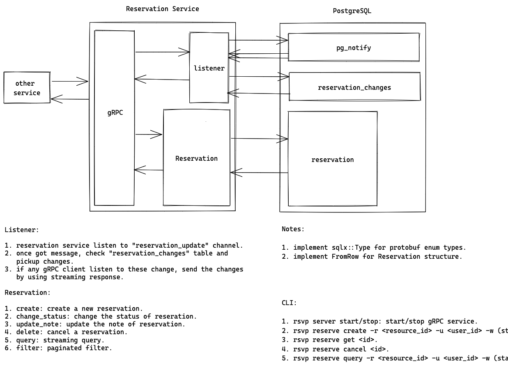

# Core Reservation Service

- Feature Name: core-reservation-service
- Start Date: 2022-10-13 21:56:10

## Summary

A core reservation service that solves the problem of reserving a resource for a period of time. We leverage postgres EXCLUDE constraints to ensure that only one reservation can be made for a given resource at a given time.

## Motivation

We need a common solution for various reservation requirements: 1) calendar booking; 2) hotel/room booking; 3) meeting room booking; 4) parking lot booking; 5) etc. Repeatedly building features for these requirements is a waste of time and resources. We should have a common solution that can be used by all teams.

## Guide-level explanation

Basic architecture:


### Service interface

We would use gRPC as a service interface. Below is the proto definition:

```proto
syntax = "proto3";
package reservation;

import "google/protobuf/timestamp.proto";

// reservation status for a given time period
enum ReservationStatus {
    RESERVATION_STATUS_UNKNOWN = 0;
    RESERVATION_STATUS_PENDING = 1;
    RESERVATION_STATUS_CONFIRMED = 2;
    RESERVATION_STATUS_BLOCKED = 3;
}

// when reservation is updated, record the update type
enum ReservationUpdateType {
    RESERVATION_UPDATE_TYPE_UNKNOWN = 0;
    RESERVATION_UPDATE_TYPE_CREATE = 1;
    RESERVATION_UPDATE_TYPE_UPDATE = 2;
    RESERVATION_UPDATE_TYPE_DELETE = 3;
}

// Core reservation object. Contains all the information for a reservation
// if ListenResponse op is DELETE, only id will be populated
message Reservation {
    // unique id for the reservation, if put into ReservationRequest, id should be empty
    int64 id = 1;
    // user id for the reservation
    string user_id = 2;
    // reservation status, used for differentaing purpose
    ReservationStatus status = 3;

    // resource id for reservation
    string resource_id = 4;
    // start time for the resercation
    google.protobuf.Timestamp start = 5;
    // end time for the resercation
    google.protobuf.Timestamp end = 6;

    // extra note
    string note = 7;
}

// To make a reservation, send a ReservationRequest with Reservation object (id should be empty)
message ReserveRequest {
    Reservation reservation = 1;
}

// Created reservation will be returned in ReserveResponse
message ReserveResponse {
    Reservation reservation = 1;
}

// To update a reservation, send an UpdateRequest. Only note is updatable
message UpdateRequest {
    int64 id = 1;
    string note = 2;
}

// Updated reservation will be returned in UpdateResponse
message UpdateResponse {
    Reservation reservation = 1;
}

// To change a reservation from pending to confirmed, send a ConfirmRequest
message ConfirmRequest {
    int64 id = 1;
}

// Confirmed reservation will be returned in ConfirmResponse
message ConfirmResponse {
    Reservation reservation = 1;
}

// To cancel a reservation, send a CancelRequest
message CancelRequest {
    int64 id = 1;
}

// Cancel reservation will be returned in CancelResponse
message CancelResponse {
    Reservation reservation = 1;
}

// To get a reservation, send a GetRequest
message GetRequest {
    int64 id = 1;
}

// Get reservation will be returned in GetResponse
message GetResponse {
    Reservation reservation = 1;
}

// Query reservation with user id, resource id, start time, end time, and status
message ReservationQuery {
    // resource if for the reservation query. If empty, query all resources
    string resource_id = 1;
    // user if for the reservation query. If empty, query all users
    string user_id = 2;
    // use status to filter result. If UNKNOWN, return all reservations
    ReservationStatus status = 3;
    // start time for the reservation query, if 0, use Infinty for start time
    google.protobuf.Timestamp start = 4;
    // end time for the reservation query, if 0, use Infinty for end time
    google.protobuf.Timestamp end = 5;
    // sort direction
    bool desc = 6;
}

// To query reservation, send a QueryRequest
message QueryRequest {
    ReservationQuery query = 1;
}

// To query reservations, order by reservatoin id
message ReservationFilter {
    // resource if for the reservation query. If empty, query all resources
    string resource_id = 1;
    // user if for the reservation query. If empty, query all users
    string user_id = 2;
    // use status to filter result. If UNKNOWN, return all reservations
    ReservationStatus status = 3;
    // cursor
    optional int64 cursor = 4;
    // page size for the query
    int64 page_size = 5;
    // sort direction
    bool desc = 6;
}

// To query reservations, send a FilterRequest
message FilterRequest {
    ReservationFilter filter = 1;
}

// filter pager info
message FilterPager {
    optional int64 prev = 1;
    optional int64 next = 2;
    optional int64 total = 3;
}

message FilterResponse {
    repeated Reservation reservations = 1;
    FilterPager pager = 2;
}

// Client can listen to reservation updates by sending a ListenRequest
message ListenRequest {}

// Server will send ListenResponse to client in streaming response
message ListenResponse {
    // update type
    ReservationUpdateType op = 1;
    // id for updated reservation
    Reservation reservation = 2;
}


// Reservation service
service ReservationService {
    // make a reservation
    rpc reserve(ReserveRequest) returns (ReserveResponse);
    // confirm a pending reservation, if reservation is not pending, do nothing
    rpc confirm(ConfirmRequest) returns (ConfirmResponse);
    // update the reservation note
    rpc update(UpdateRequest) returns (UpdateResponse);
    // cancel a reservation
    rpc cancel(CancelRequest) returns (CancelResponse);
    // get a reservation by id
    rpc get(GetRequest) returns (GetResponse);
    // query reservations by resource id, user id, status, start time, end time
    rpc query(QueryRequest) returns (stream Reservation);
    // filter reservations, order by reservatioin id
    rpc filter(FilterRequest) returns (FilterResponse);
    // another system could monitor newly added/confirmed/cancelled reservations
    rpc listen(ListenRequest) returns (stream Reservation);
}
```

### Database schema

We use postgres as the database. Below is the schema:

```sql
CREATE SCHEMA rsvp; -- SCHEMA like namespace
CREATE TYPE rsvp.reservation_status AS ENUM ('unknow', 'pending', 'confirmed', 'blocked');
CREATE TYPE rsvp.reservation_update_type AS ENUM ('unknown', 'create', 'update', 'delete');
CREATE EXTENSION btree_gist; -- for using gist

CREATE TABLE rsvp.reservations (
    id uuid NOT NULL DEFAULT gen_random_uuid(),
    user_id VARCHAR(64) NOT NULL, -- user_id may be int or uuid in other systems, we want to be compatible with it, so use string
    status rsvp.reservation_status NOT NULL DEFAULT 'pending',

    resource_id VARCHAR(64) NOT NULL, -- resource_id may be int or uuid in other systems, we want to be compatible with it, so use string
    timespan TSTZRANGE NOT NULL,

    note TEXT,

    CONSTRAINT reservations_pkey PRIMARY KEY (id),
    CONSTRAINT reservations_conflict EXCLUDE USING gist (resource_id WITH =, timespan WITH &&)
);
CREATE INDEX reservations_resource_id_idx ON rsvp.reservations (resource_id);
CREATE INDEX reservations_user_id_idx ON rsvp.reservations (user_id);

-- resevation change queue
CREATE TABLE rsvp.reservation_changes (
    id SERIAL NOT NULL,
    reservation_id uuid NOT NULL,
    op rsvp.reservation_update_type NOT NULL,
);

-- trigger for add/update/delete a reservation
CREATE OR REPLACE FUNCTION rsvp.reservations_trigger() RETURNS TRIGGER AS $$
BEGIN
    IF TG_OP = 'INSERT' THEN
        -- update reservation_changes
        INSERT INTO rsvp.reservation_changes (reservation_id, op) VALUES (NEW.id, 'create');
    ELSIF TG_OP = 'UPDATE' THEN
        -- if status changed, update reservation_changes
        IF OLD.status <> NEW.status THEN
            INSERT INTO rsvp.reservation_changes (reservation_id, op) VALUES (NEW.id, 'update');
        END IF;
    ELSIF TG_OP = 'DELETE' THEN
        -- update reservation_changes
        INSERT INTO rsvp.reservation_changes (reservation_id, op) VALUES (OLD.id, 'delete');
    END IF;
    -- notify a channel called reservation_update
    NOTIFY reservation_update;
    RETURN NULL;
END;
$$ LANGUAGE plpgsql;

CREATE TRIGGER reservations_trigger
    AFTER INSERT OR UPDATE OR DELETE ON rsvp.reservations
    FOR EACH ROW EXECUTE PROCEDURE rsvp.reservations_trigger();
```

Here we use EXCLUDE constraint provided by postgres to ensure that on overlapping reservations cannot be made for a given resource at a given time.

```sql
CONSTRAINT reservations_conflict EXCLUDE USING gist (resource_id WITH =, timespan WITH &&)
```


We also use a trigger to notify a channel when a reservation is added/updated/deleted. To make sure even we missed certain messages from the channel when DB connection is down for some reason, we use a queue to store reservation changes. Thus when we receive a notification, we can query the queue to get all the changes since last time we checked, and once we finished processing all the changes, we can delete them from the queue.

### Core flow



## Reference-level explanation

TBD

## Drawbacks

N/A

## Rationale and alternatives

N/A

## Prior art

N/A

## Unresolved questions

- how to handle repeated reservation? - is this more ore less a business logic which shouldn't be put into this layer? (non-goal: we consider this is a business logic and should be handled by the caller)
- if load is big, we may use an external queue for recording changes.
- we haven't considered tracking/observability/deployment yet.
- query performance might be an issue - need to revisit the index and also consider using cache.

## Future possibilities

TBD
